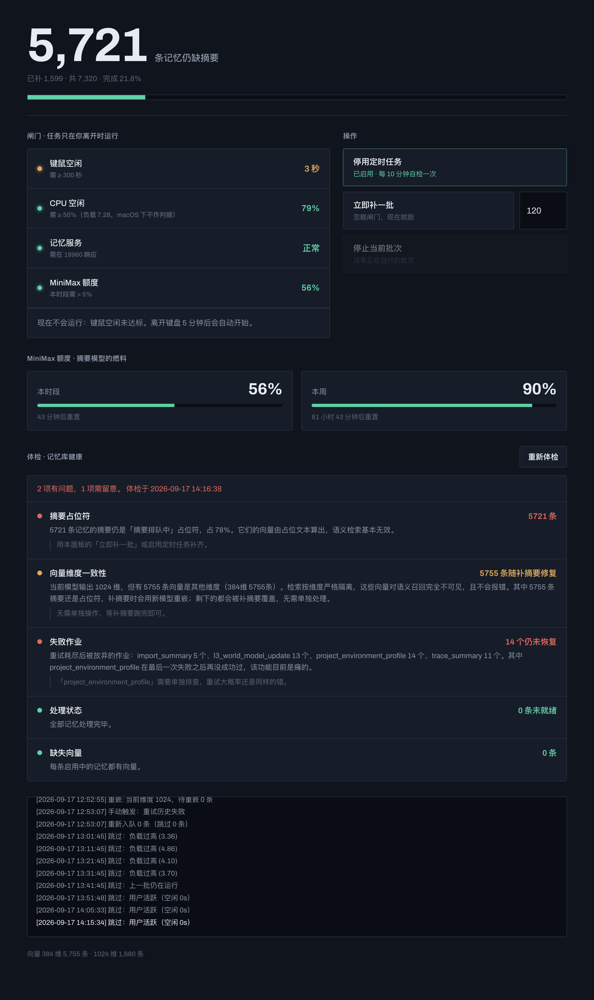
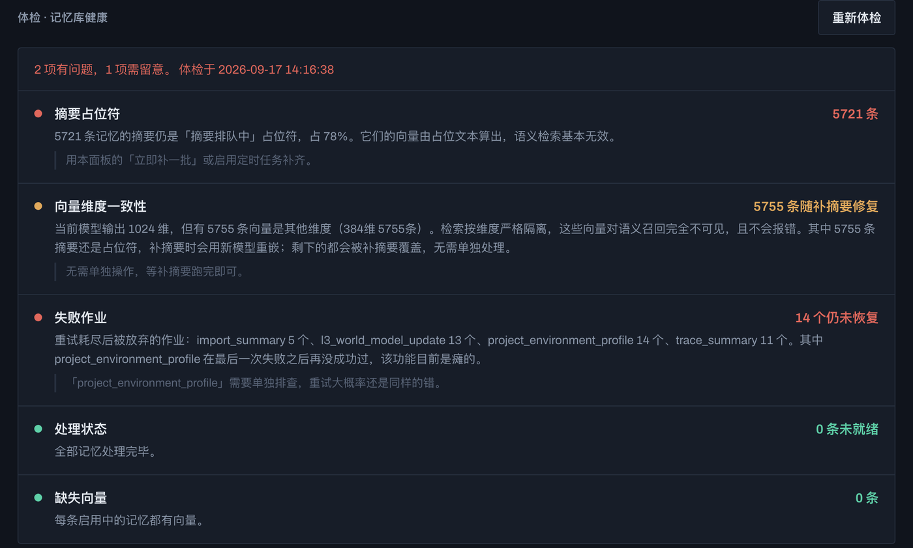

# memmy-backfill

给本地 [memmy](https://memmy.bot) 记忆库用的补全工作台：一个只监听 `127.0.0.1` 的小面板，负责找出记忆库里**不会报错但已经坏掉**的部分，并把它们修好。

零第三方依赖，只用 Python 标准库。



---

## 为什么需要它

memmy 写入记忆时会先存一条 `摘要排队中` 的占位符，随后由后台作业补上真实摘要。如果那个作业失败了——模型名过期、额度耗尽、上下文超限——占位符就**永远留在那里**。

问题在于它不报错。`memory_processing_state` 里这些记忆是 `ready`，因为判定条件只看「有没有向量」，而占位文本本身也能算出向量。于是：

- 向量是拿 `摘要排队中` 这五个字算的，对任何查询都不相关
- 语义检索静默失效，命中率下降，但没有任何地方提示
- 官方面板显示一切正常

本机实测：7,318 条记忆里 **6,472 条**是这种状态，占 88%。

换嵌入模型会制造第二个同类问题。sqlite-vec 按维度分表，检索时维度不匹配直接返回空——旧模型产生的向量对新模型**完全不可见**，同样不报错。

---

## 能做什么

### 体检

五项检查，每项给结论、解释后果、说明怎么修：

| 检查项 | 在查什么 |
|---|---|
| 摘要占位符 | 有多少记忆的摘要还是占位文本 |
| 向量维度一致性 | 有多少向量因为换过模型而不可见 |
| 失败作业 | dead-letter 里哪些类型**在最后一次失败后再没成功过** |
| 处理状态 | 卡在 `failed` 的记忆 |
| 缺失向量 | 完全没有向量、只能靠全文检索命中的记忆 |



「失败作业」不单纯数个数。同类型作业如果在失败之后又成功过，说明故障已经过去，那些记录只是历史噪音；只有最后一次成功早于最后一次失败，才说明这个功能真的还瘫着。

### 修复

体检发现问题时，对应项下面会出现按钮：

- **重嵌旧向量** — 把旧维度的向量重新嵌入到当前模型的维度
- **重试历史失败** — 重新入队卡在 `failed` 的记忆

第二个按钮绕过了一个坑：memmy 遇到配置类错误会把 `retry_action` 写成 `'none'` 永不重试，而那个判断只看数据库里存的旧错误字符串，不会重新探测。配置修好之后这些记忆仍然永久卡着，官方重试 API 也会拒绝，并回显那条早已过时的错误信息。

### 闲时自动补全

补几千条摘要要跑好几个小时，还要烧掉不少 token。手动盯着跑不现实，
半夜定时跑又可能撞上你正在用电脑。所以这里的策略是：**只在机器真闲的时候干活，你一碰键盘就立刻让路。**

`launchd` 每 10 分钟唤醒一次，四道闸门全过才开工：

| 闸门 | 判据 | 为什么 |
|---|---|---|
| 键鼠空闲 | `ioreg` 读 `HIDIdleTime` ≥ 300 秒 | 你离开了才动手 |
| CPU 空闲 | `iostat` 读 `id` 列 ≥ 50% | 别跟后台的备份、索引抢 |
| 记忆服务 | 18960 健康检查 | 服务没起就别白跑 |
| 模型额度 | 本时段剩余 > 5% | 给交互式使用留余量 |

**这里不用 load average。** macOS 把大量等待态线程也计入负载，一台桌面机的基线常驻 4 左右，
而同时 CPU 实际空闲 80%+。拿它当闸门会永远开不了——本仓库早期版本就踩过，
闸门连续几小时一次没放行过，日志里全是「负载过高」，而机器其实一直闲着。

开工之后还有三层保护：

- **随时中止** — 消费循环每轮都重新检查空闲状态，你一回来（空闲跌破 60 秒）当前批次立刻停，不等跑完
- **不抢资源** — launchd 的 `ProcessType: Background` + `LowPriorityIO` + `Nice 10`，CPU 和磁盘都让给前台
- **不会叠加** — 用 `pgrep` 做重入检查（macOS 没有 `flock`），上一批没跑完就直接跳过这一轮

单批上限 25 分钟，跑到就收工，下一轮再来。所以它是**一点一点啃**，
不会出现「电脑被占用半小时动不了」的情况。

### 把 token plan 的余量用掉

摘要模型如果用的是 MiniMax 的 **token plan**（按时段配额的订阅制，不是按量计费），
那么每个时段用不完的额度**到点就作废**。对补全任务来说，这是免费的燃料。

面板直接查官方的余量接口：

```
POST https://www.minimaxi.com/v1/token_plan/remains
```

拿到 `current_interval_remaining_percent` 和 `current_weekly_remaining_percent` 之后：

- **额度栏**显示本时段和本周的剩余百分比，以及各自还有多久重置
- **闸门**在本时段剩余 ≤ 5% 时拦住补全，把最后那点留给你交互用
- **查询失败时放行，不拦截** — 额度查不到只是看不见，不该因此停掉补全

于是整件事变成：你不在电脑前的时候，系统用那些**反正也要过期**的配额，
一点点把记忆库补完。等你回来，它已经让开了。

> 额度查询是 MiniMax 特有的。换别的供应商这一栏会显示「未知」，
> 闸门自动放行，其余功能不受影响。

---

## 安装

需要本机已安装并运行 memmy memory-service（默认端口 18960）。

```bash
git clone <this repo> ~/Developer/memmy-backfill
cd ~/Developer/memmy-backfill
./install.sh
```

`install.sh` 会生成带图标的 **`memmy 工作台.app`**，双击即可，浏览器会自动打开 `http://127.0.0.1:19180`。

先点一次「开始体检」。

---

## 文件

| 文件 | 作用 |
|---|---|
| `server.py` | 面板服务，含体检与修复接口 |
| `panel.html` | 前端（单文件，无构建步骤） |
| `seed.py` | 把占位符记忆排进 `import_summary` 队列 |
| `drain.py` | 消费队列，带闲时/负载中断 |
| `reembed.py` | 重嵌旧维度向量 |
| `run-idle-batch.sh` | launchd 每次唤醒执行的闸门脚本 |
| `install.sh` | 生成并加载 launchd 任务 |
| `启动工作台.command` / `停止工作台.command` | 启停面板的 shell 入口 |
| `build-app.sh` | 生成双击启动器 `memmy 工作台.app` |
| `icon/make-icon.py` | 生成图标（图形即本工具报告的那件事：实心=摘要已补好，空心=还是占位符） |

---

## 关于安全

- 面板只绑 `127.0.0.1`，不接受外部连接
- 摘要模型的 API key 在需要查额度时从 `~/.memmy/config.yaml` 现读，不落盘、不写日志
- 所有数据库读取用只读连接；写入只碰 `evolution_jobs` 和 `memory_processing_state` 两张表
- 日志只记数量和状态，不记记忆内容

---

## 一点说明

`seed.py` 必须用 `import_summary` 而不是 `trace_summary`。memmy 内部用 `memoryHasImportPipeline()` 决定记忆归哪条流水线，排错了作业会被直接拒绝（`trace summary target is invalid`），而且是一条条静默失败。

判断依据是 `internal_info.plugin_algorithm` 以 `memory.add.import_async.` 开头，或者标签里有 `agent-source`。不满足的记忆本脚本会跳过，不去猜。

---

## 许可

MIT
